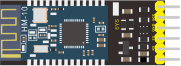
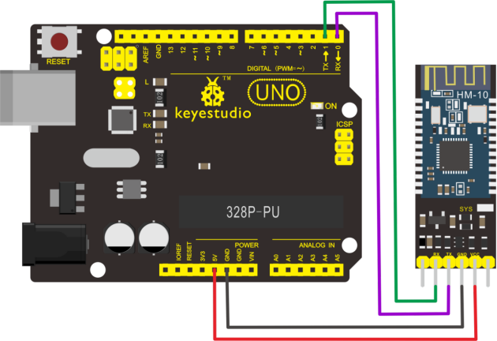
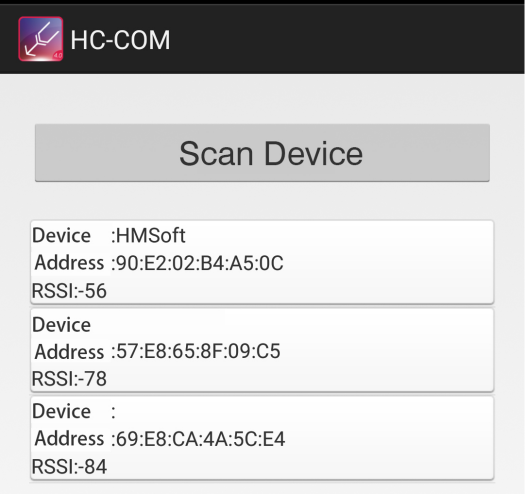
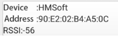
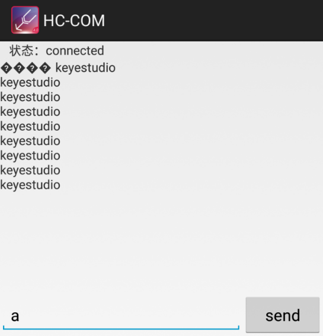
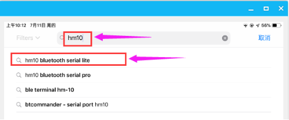
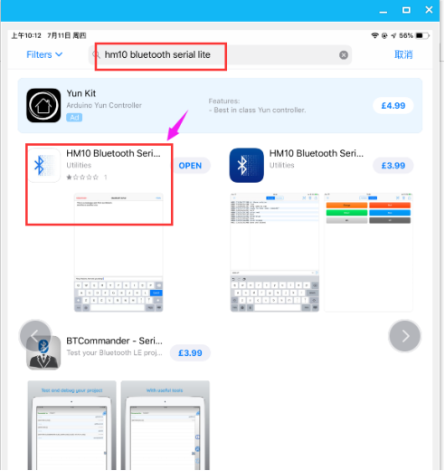
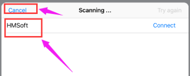
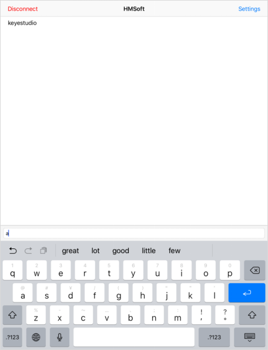

# KS0455 keyestudio HM-10 Bluetooth-4.0 V3 Compatible with HC-06 Pins



## 1. Description

Bluetooth technology is a wireless standard technology that enables short-distance data exchange between fixed devices, mobile devices, and building personal area networks (using UHF radio waves in the ISM band of 2.4 to 2.485 GHz).

The Keyestudio HM-10 Bluetooth-4.0 V3 module is a master-slave machine. When use as the Host, it can send commands to the slave actively; when use as the Slave, it can only receive commands from the host.

The HM-10 Bluetooth module supports the Bluetooth 4.0 protocol, which not only supports Android mobile, but also supports iOS system.

## 2. Technical Details

- Bluetooth protocol: Bluetooth Specification V4.0 BLE
- No byte limit in serial port Transceiving
- In open environment, realize 100m ultra-distance communication with iphone4s
- USB protocol: USB V2.0
- Working frequency: 2.4GHz ISM band
- Modulation method: GFSK(Gaussian Frequency Shift Keying)
- Transmission power: -23dbm, -6dbm, 0dbm, 6dbm, can be modified by AT command.
- Sensitivity: ≤-84dBm at 0.1% BER
- Transmission rate: Asynchronous: 6K bytes ; Synchronous: 6k Bytes
- Security feature: Authentication and encryption
- Supporting service: Central & Peripheral UUID FFE0, FFE1
- Power consumption: Auto sleep mode, stand by current 400uA~800uA, 8.5mA during transmission.
- Power supply: 5V DC
- Working temperature: –5 to +65 Centigrade


## 3. Pins Description

| Pins  | Description                                                  |
| ----- | ------------------------------------------------------------ |
| BRK   | Input pin; short press for control, or input a low-level single pulse of about 1000ms, you can implement the following features:<br>(1) In sleep state: <br>The module will be woken up to normal status. If AT+NOTI is turned on, the serial port will receive<br>OK+WAKE<br>(2) In connected state: <br>The module will initiate a disconnect request<br>(3) In standby state: <br>The module will return to the factory default state. |
| RXD   | Serial data input                                            |
| TXD   | Serial data output                                           |
| GND   | ground                                                       |
| VCC   | Power positive input 5V                                      |
| STATE | Output pin<br>Indicates the working states:<br>Slow flash in standby mode - repeat 500ms pulse;<br>Long bright in connection state - high level.<br>You can also set it to no flashing in the standby state, and long bright in the connection state. |

## 4. Wiring Diagram



## 5. Test Code

Download Resource :  [Resource](./Resource.7z)

Note： before uploading the code, you need to import the library files; otherwise, the code upload will fail.

When uploading the code, CANNOT connect the Bluetooth module; otherwise uploading fails!
You are supposed to upload the code to control board, then connect the Bluetooth module.

```c
#include "DFRobot_ST7687S_Latch.h"

#ifdef __AVR__
uint8_t pin_cs = 3, pin_rs = 5, pin_wr = 6, pin_lck = 7;
#else
uint8_t pin_cs = D3, pin_rs = D5, pin_wr = D6, pin_lck = D7;
#endif

DFRobot_ST7687S_Latch tft(pin_cs, pin_rs, pin_wr, pin_lck);

void setup(void)
{
  Serial.begin(115200);
  tft.begin();
  tft.fillScreen(DISPLAY_WHITE);
}

void loop(void)
{
  tft.drawTriangle(-20, -50, 0, 0, 50, 20, DISPLAY_ORANGE);  //draw triangle
  delay(1000);
  tft.fillScreen(DISPLAY_WHITE);
}
```

## 6. Result

First should install the APP on the cellphone.

**Android APP**

Allow APP to access “location” in settings of your cellphone when connecting to Bluetooth module.

We only provide Android APP.

APP installed well, you can see the iconon your Android phone.

After wiring, upload the test code to UNO R3 board and then connect the Bluetooth module. Powered on, Bluetooth module’s built in LED flashes.

Open the Android APP,click to scan device. As shown below.


Click Scan Device to search the Bluetooth.



Click the first deviceto connect the Bluetooth.

Connected, built-in LED on the Bluetooth module is normally on. APP interface will show the state connected.


On the bar enter letter **a**, and click to send, APP will print out the character “keyestudio” and D13 indicator on the UNO R3 board will flash once.

Continue to send the letter **a**, APP prints out multiple “keyestudio” character and D13 indicator flashes.



**mac/iOS APP**

You need to download the mac/iOS compatible APP in APP store.

First we enter the APP store, search hm10, and select the **hm10 bluetooth serial lite**.



Click to install the APP, as shown below.



After the APP is installed, a Bluetooth iconwill pop up on your phone. Click to enter the APP.

Upload the test code to control board successfully, then plug in the Bluetooth module.

Open the Bluetooth APP, click to start searching and pairing the Bluetooth module. Clickto copnnect HM-10 Bluetooth module.

Connected, the built-in LED on the Bluetooth module will be from quick flash to normally on.



On the input bar enter a letter a, and click to send, APP will print out the character “keyestudio” and D13 indicator on the UNO R3 board will flash once.

Continue to send the letter a, APP prints out multiple “keyestudio” characters and D13 indicator flashes.

